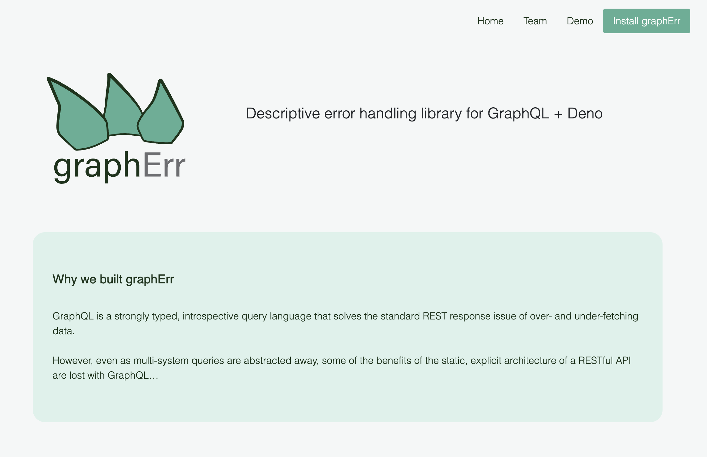

# graphErr.land

### Homepage for [graphErr](https://github.com/oslabs-beta/graphErr)

  

GraphErr provides descriptive GraphQL error handling for Deno/Oak servers.

### View the graphErr repo on [GitHub](https://github.com/oslabs-beta/graphErr) 

### Visit us at [graphErr.land](https://grapherr.land)

### Add graphErr to your GraphQL project in [Deno](https://deno.land/x/grapherr)

### Connect with the graphErr team on [LinkedIn](https://linkedin.com/company/grapherr)

